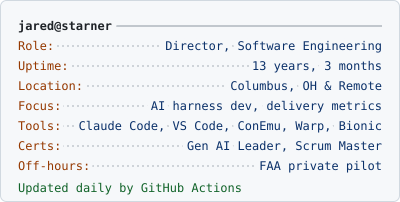

<!-- card:start -->
<picture>
  <source media="(prefers-color-scheme: dark)" srcset="assets/card-dark.svg">
  
</picture>
<!-- card:end -->

Hey, welcome to my GitHub Profile. Most of my work lives in private repos; experiments ship daily at [thesandbox.page](https://thesandbox.page).

**Latest experiments**
<!-- experiments:start -->
- [Box 1725](https://thesandbox.page/box-1725/ "The case file on a roadside mailbox that enforces postal law personally: raise your clearance, peel the redaction tape, and post it a stamped letter, and it writes back in words cut from the mail it has kept."): the case file on a roadside mailbox that…
- [Grow a tree](https://thesandbox.page/grow-a-tree/ "Plant a spruce, an oak, or a birch and grow it from seed to ancient tree in 3D, branch by branch, as buds compete for light and space, while it sways and rustles in a breeze you set."): plant a spruce
- [Ad hell](https://thesandbox.page/ad-hell/ "A modest toast recipe buried under every ad format the industry agreed to retire and every deceptive pattern in the catalog: read it to the end, or flip the ad blocker and watch it all fall away."): a modest toast recipe buried under every…
<!-- experiments:end -->

**Generative AI Leader** 
Google Cloud &middot; Jun 2026 &middot; [Verify on Credly](https://www.credly.com/badges/04e8a3e0-7407-4dc6-ba24-8ac551aa67cf/public_url)

<picture>
  <source media="(prefers-color-scheme: dark)" srcset="assets/skills-dark.svg">
  
</picture>
